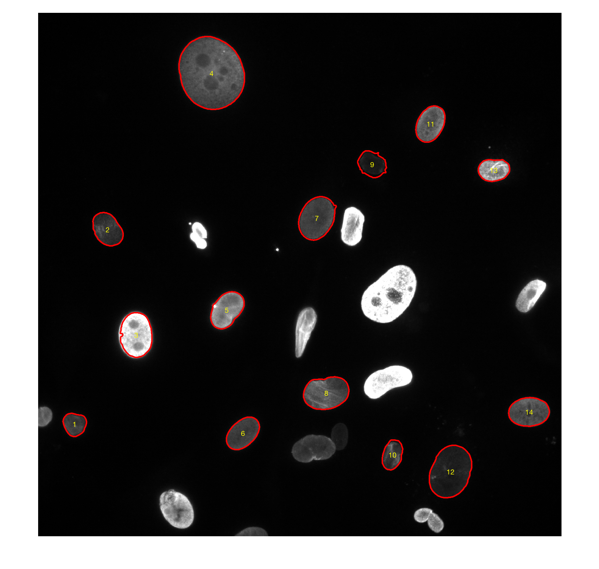
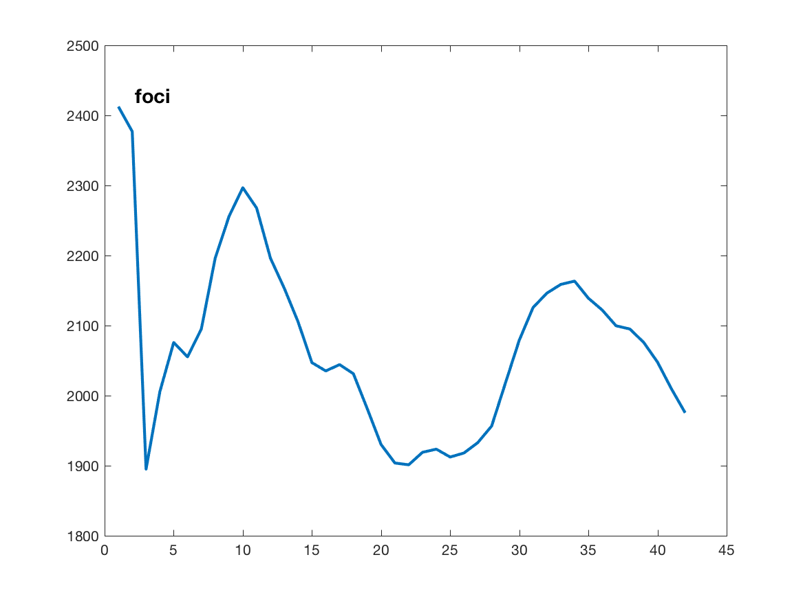
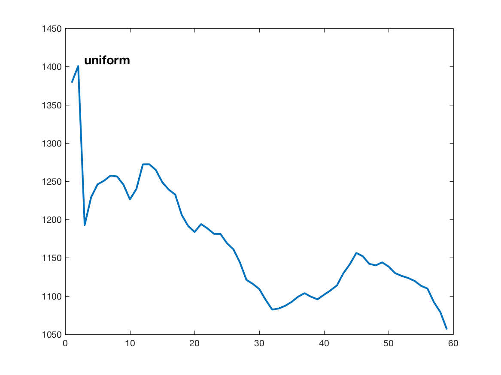
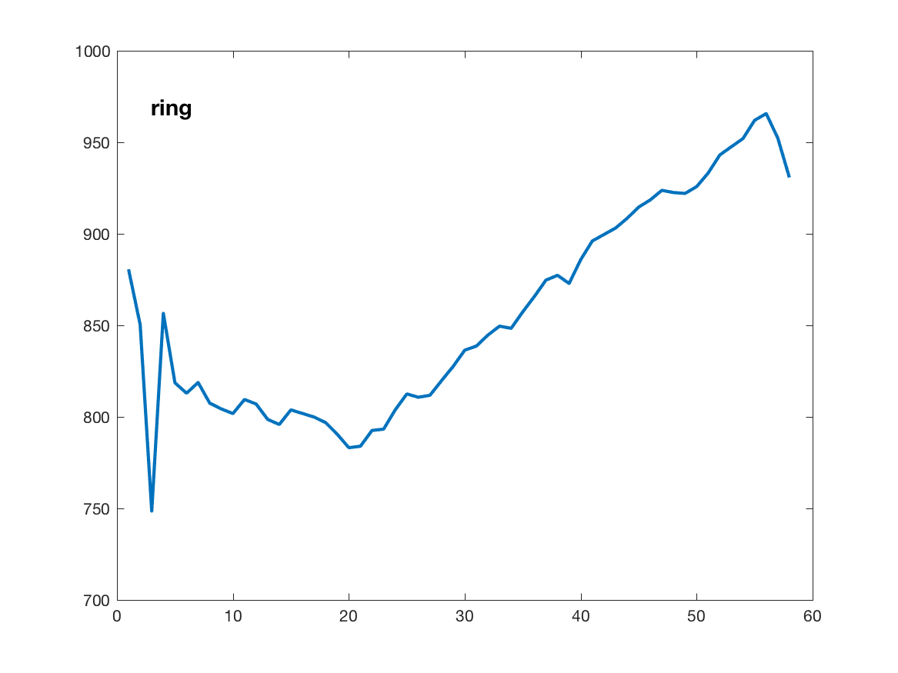
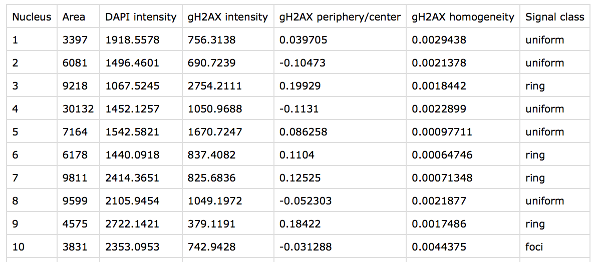
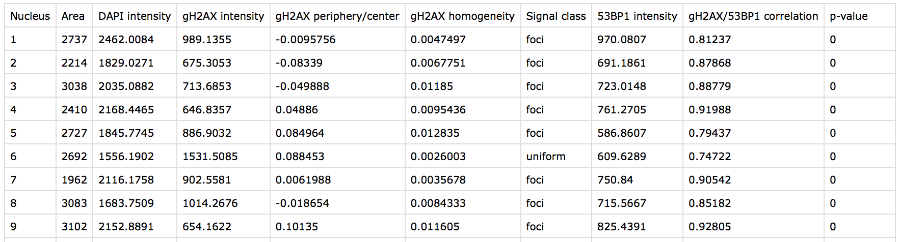
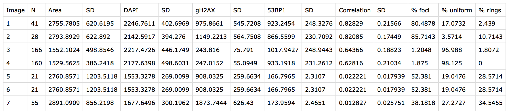

# Nuclei

This is a script to analyse the spacial appearance of DNA damage in nuclei and test for colocalisation with other markers.

## Running the script

To start the analysis, run the "nuclei.m" file. It will first ask what were the channels used for each staining. In case there is only DAPI and &#947;H2AX, put "0" in the 53BP1 input dialog's field.  

Then, it will ask about the format of the pictures, so indicate in which bioformat the pictures were saved, e.g. "nd2". The files need to be named in numerical orders starting with 1, i.e. "1", "2", "3", etc.

In the next step, the script creates folders, where analysed data will be saved. This folders are the following:

1. *images_analysed* - saves each DAPI chanel image with outlines of the nuclei, with each nucleus being numbered with numbers corresponding to what is in other files. 

1. *distributions* - there will be folders for individual images with the names corresponding to each image, in which there placed radial distributions of &#947;H2AX for each nucleus (the number of the nucleaus is the same as on the images described above). The classification of the nucleus is written on each image. Here are a couple of examples:  
 
 

1. *cellbycelldata* - there will be the tables with all analysed data. First there will be ".csv" files for each image with information about each nuclei, i.e. overall area in pixels, mean DAPI intensity, mean &#947;H2AX intensity, ratio of &#947;H2AX intensity within the peripheral quartile and the rest of the nucleus, homogeniety of &#947;H2AX signal based on foci detection (see below), and classification of the nucleus. In case there is other protein e.g. 53BP1 stainig, there will be additionally information about its mean intensity and Pearson's correlation coefficient between this protein and &#947;H2AX, and the p-value of this correlation being non-zerp (see examples below).  
 
 

Additionally, the same folder will contain the file "stats_all.csv", where all above data will be pulled, with the additional front column corresponding to the number of the image. 

Finally, the folder will have a file "stats_averaged.csv", where an average data for each image will be displayed, namely: number of the image, number of analysed nuclei, mean area, standard deviation of area, mean DAPI intensity, standard deviation of DAPI intensity, mean &#947;H2AX intensity, standard deviation of &#947;H2AX intensity, mean 53BP1 intensity (if used), standard deviation of 53BP1 intensity (if used), mean correlation coefficient between &#947;H2AX and 53BP1, its standard deviation, and finally the percent of rings classified as "having foci distribution of &#947;H2AX", having its "uniform" distribution, and having "rings".
 
 

## Algorythm
The nuclei were detected using the DAPI channel image: the original image was filtered with a 2-D Gaussian smoothing kernel, which was used to create a binary image with a globally automatically determined threshold. A series of dilation, hole filling and eroding was applied to the binary image with parameters initially manually adjusted by the investigator and then fixed throughout the analysis. The resulting image was used to detect objects, which were filtered by their area (greater than 400px), eccentricity (less than 0.8), shape regularity (4&#215;&#960;&#215;Area2/Perimeter >0.85), and signal intensity (less than 2*Median Intensity of all objects) to exclude all objects that did not represent nuclei.  
To classify nuclei by &#947;H2AX distribution, the &#947;H2AX signal in each nucleus was binarized with an adaptive threshold, which uses local first-order image statistics around each pixel. This allowed an efficient detection of foci even in the presence of high background. The nuclei with number of foci divided by the nucleus area being greater than 0.0035 were considered as having foci &#947;H2AX distribution. The nuclei with non-foci &#947;H2AX distribution were then further classified into uniform and ring phenotypes. Namely, the profiles of &#947;H2AX intensity from the center of mass of each object to each pixel at the object boundary were created. These profiles were then resampled to be of the same length, equal to their maximum length, and averaged to create an average radial intensity profile for each nucleus. The nucleus was classified as a ring if the difference between mean intensity in its last quartile and first three quartiles was greater than 10% of overall mean intensity. All above cut-off values were determined empirically by testing images from different experiments and identifying a combination, which was the most efficient in detecting and classifying nuclei. 
Finally, the correlation between &#947;H2AX and 53BP1 signal was determined by calculating the pairwise correlation coefficient between their intensities at each pixel within individual nuclei. 
